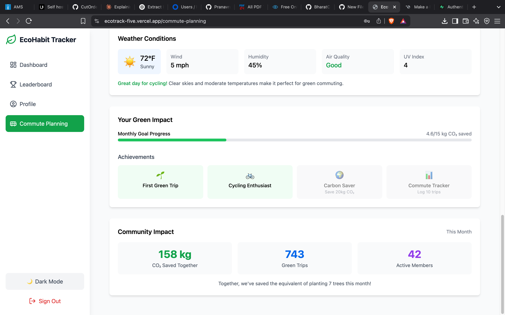
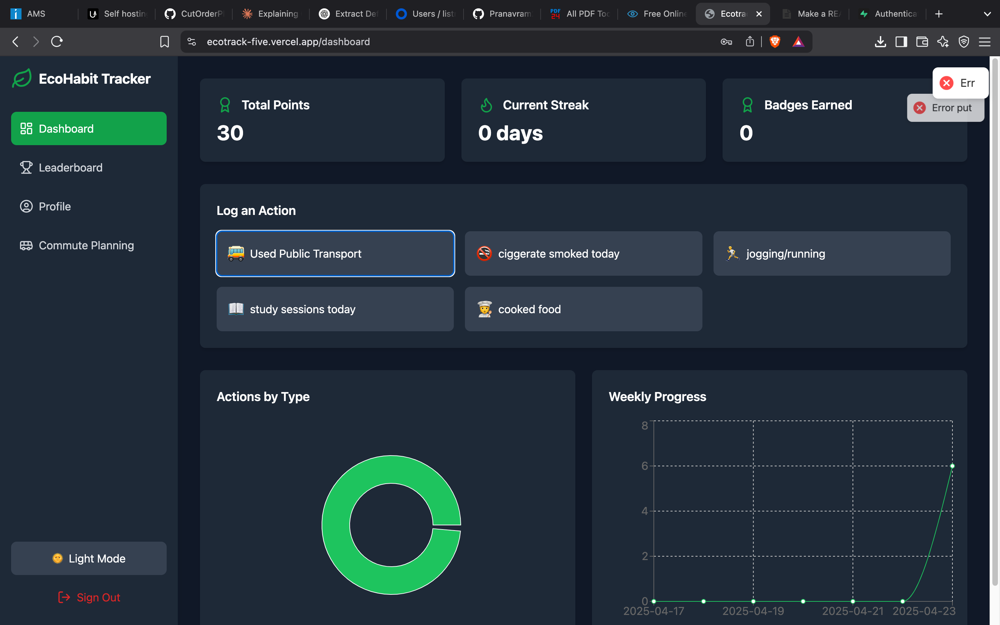
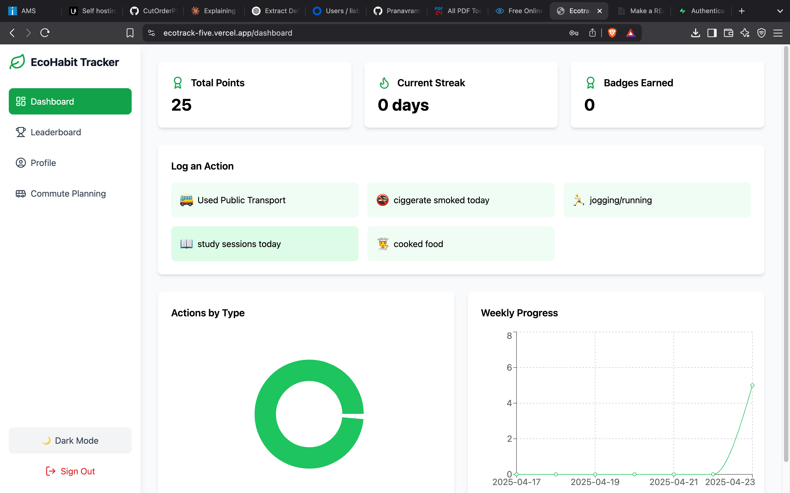
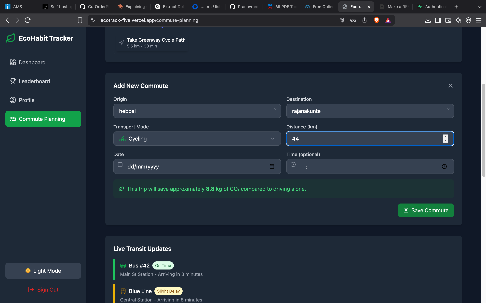
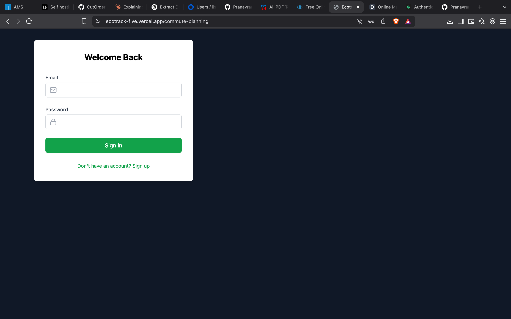

# EcoHabit Tracker 🌿

EcoHabit Tracker is a full-stack web application designed to encourage sustainable living through habit tracking and gamification. Users can log eco-friendly actions, earn points, unlock achievements, and visualize their environmental impact — all in real time.

## ⚙️ Tech Stack

- **Frontend:** React 18 + TypeScript
- **Authentication & Database:** Supabase (Auth + PostgreSQL)
- **Styling:** Tailwind CSS
- **Routing:** React Router v6
- **Charts:** Recharts
- **Notifications:** React Hot Toast
- **Build Tool:** Vite
- **Code Quality:** ESLint

## 🌟 Core Features

### 👤 User Authentication
- Email & password sign-up / login
- Session management
- Protected routes
- Dark mode toggle

### ✅ Eco-Action Tracking
- Log daily eco-friendly actions (e.g., biking, skipping plastic, eating plant-based)
- Earn **5 points per action**
- Categories include:
  - Transport 🚴
  - Plastic-Free 🌊
  - Plant-Based Meals 🥗
- Real-time syncing with Supabase

### 🏆 Gamification
- Achievement badges based on milestones
- Daily streak tracking
- Global leaderboard for friendly competition
- Progress visualization and rewards

### 📊 Data Visualization
- **Pie chart** showing action distribution
- **Line chart** of weekly progress
- Interactive tooltips
- Realtime feedback

### 🔐 Security Features
- Row Level Security (RLS) on Supabase
- Protected API endpoints
- Per-user data isolation
- Robust data validation

## 📸 Screenshots

1. **Dashboard View**  
   

2. **Action Logging Interface**  
   

3. **Progress Tracker**  
   

4. **Leaderboard**  
   

5. **Dark Mode & Charts**  
   

## 🚀 Getting Started

1. Clone the repository:
   ```bash
   git clone https://github.com/Pranavram22/ecotrack.git
   cd ecotrack
